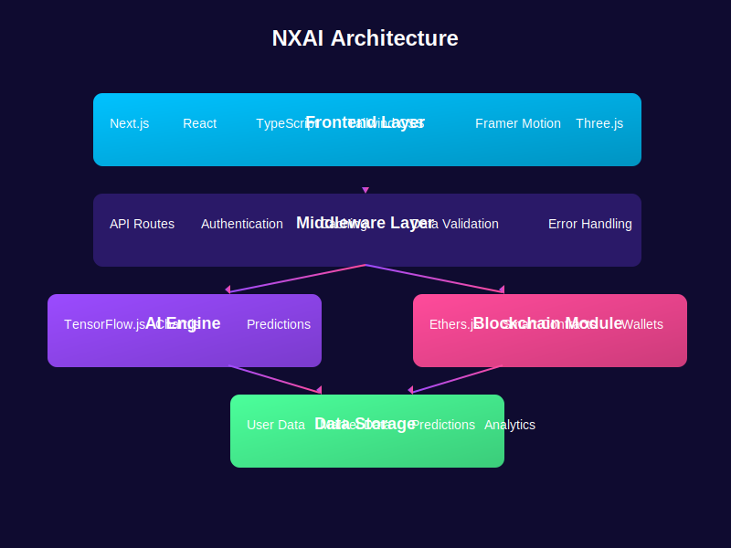
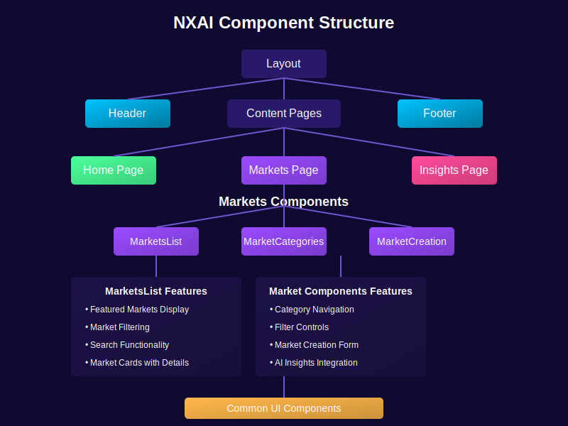
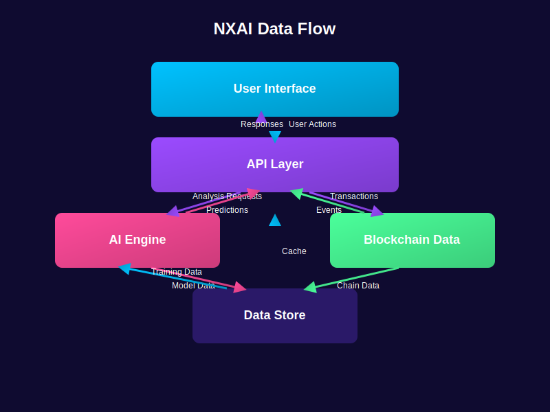

# NXAI - AI-Powered Blockchain Prediction Platform

<div align="center">
  
</div>

NXAI is a groundbreaking platform that seamlessly integrates advanced artificial intelligence with blockchain technology to revolutionize prediction markets. By harnessing state-of-the-art AI models and transparent blockchain infrastructure, NXAI delivers actionable predictive insights and creates an efficient marketplace for collective intelligence gathering and monetization.

## 🚀 Features

- **AI-Powered Market Insights**: Real-time market sentiment analysis, price movement predictions, and pattern recognition across crypto assets.
- **Decentralized Prediction Markets**: Create and participate in prediction markets on various outcomes with transparent verification and rewards.
- **Portfolio Integration**: Get personalized recommendations based on your holdings with AI-enhanced portfolio analysis.
- **Community Governance**: Participate in platform decisions through decentralized governance with voting power based on token holdings.
- **Data Contribution Rewards**: Earn tokens by providing labeled data to improve model accuracy and participating in model validation.

## 🔗 Links

- Website: [www.nxaiagent.xyz](https://www.nxaiagent.xyz)
- Twitter: [@NX_AI_](https://x.com/NX_AI_)
- GitHub: [NXAI-HUB](https://github.com/NXAI-HUB)

## 📋 Project Architecture

<div align="center">
  
</div>

The NXAI platform follows a modular architecture designed for scalability, maintainability, and performance:

### Core Layers

- **Frontend Layer**: Built with Next.js, React, TypeScript, and Tailwind CSS for a responsive and intuitive user interface.
- **Middleware Layer**: Handles API routes, authentication, caching, and error management to ensure reliable communication between frontend and backend services.
- **AI Engine**: Powered by TensorFlow.js and Chart.js to provide predictive analytics and visualizations.
- **Blockchain Module**: Leverages Ethers.js for wallet connections, smart contract interactions, and transaction processing.
- **Data Storage**: Manages user data, market data, predictions, and analytics information.

### Directory Structure

```
nxai/
├── src/
│   ├── app/              # Next.js application pages
│   │   ├── markets/      # Prediction markets pages
│   │   ├── insights/     # AI insights pages
│   │   └── ...           # Other application pages
│   ├── components/       # Reusable React components
│   │   ├── common/       # Common UI elements
│   │   ├── layout/       # Layout components (Header, Footer)
│   │   ├── home/         # Homepage-specific components
│   │   ├── markets/      # Market-related components
│   │   ├── insights/     # Insight-related components
│   │   └── ...           # Other component categories
│   ├── hooks/            # Custom React hooks
│   ├── lib/              # Utility libraries and API clients
│   ├── types/            # TypeScript type definitions
│   ├── utils/            # Helper functions
│   └── context/          # React context providers
├── public/               # Static assets
│   └── images/           # Image assets
└── ...                   # Configuration files
```

## 💻 Technical Implementation

### Frontend Implementation

The NXAI frontend is built using a modern tech stack focused on performance and developer experience:

- **Next.js**: Server-side rendering for improved SEO and initial load performance
- **React**: Component-based architecture for maintainable UI development
- **TypeScript**: Static typing to reduce runtime errors and improve code quality
- **Tailwind CSS**: Utility-first CSS framework for responsive design
- **Framer Motion**: Animation library for smooth UI transitions
- **Three.js**: 3D visualization library for interactive data presentation

### Component Structure

<div align="center">
  
</div>

### Key Components

1. **Markets Module**:
   - `MarketsList`: Displays active prediction markets with filtering options
   - `MarketCategories`: Provides category-based navigation and filtering
   - `MarketCreation`: Form for creating new prediction markets

2. **Insights Module**:
   - AI-powered analysis dashboard
   - Trend visualization components
   - Recommendation engine

3. **Layout Components**:
   - Responsive navigation
   - User authentication interface
   - Dark mode optimized design

## 📊 Data Flow

<div align="center">
  
</div>

The NXAI platform implements a robust data flow architecture:

1. **User Interaction Flow**:
   - User actions from the interface trigger API requests
   - API layer processes requests and returns appropriate responses
   - UI updates based on returned data

2. **AI Analysis Flow**:
   - Market data is sent to the AI engine for analysis
   - AI models process data and generate predictions
   - Predictions are stored and displayed to users

3. **Blockchain Integration Flow**:
   - User transactions are processed through the blockchain module
   - Smart contract events are captured and processed
   - Blockchain data is cached for improved performance

4. **Data Storage Flow**:
   - User data, market information, and predictions are stored in the data layer
   - Cached data improves application performance
   - Training data is used to continuously improve AI models

## 🔮 Roadmap

### Phase 1: Foundation & MVP (Q2-Q3 2025)
- NXAI Insight Engine Alpha
- Web application with core functionality
- Basic prediction creation interface
- Token staking mechanism

### Phase 2: Platform Launch (Q4 2025)
- Comprehensive prediction marketplace
- Portfolio tracking integration
- Mobile-responsive web application
- User reputation system

### Phase 3: Token Launch & Growth (Q1 2026)
- Full platform launch
- Advanced prediction market tools
- Enhanced AI insights with alerts
- Initial governance functionality

### Phase 4: Ecosystem Expansion (Q2-Q3 2026)
- NXAI Mobile App (iOS and Android)
- Advanced Portfolio Integration
- API access for developers
- Additional prediction categories

## 🚀 Getting Started

### Prerequisites
- Node.js (v18 or higher)
- npm or yarn

### Installation
1. Clone the repository
   ```bash
   git clone https://github.com/NXAI-HUB/nxai.git
   cd nxai
   ```

2. Install dependencies
   ```bash
   npm install
   # or
   yarn install
   ```

3. Run the development server
   ```bash
   npm run dev
   # or
   yarn dev
   ```

4. Open [http://localhost:3000](http://localhost:3000) with your browser to see the result.

## 📄 License

This project is licensed under the MIT License - see the LICENSE file for details.

## 🤝 Contributing

Contributions are welcome! Please feel free to submit a Pull Request.

1. Fork the repository
2. Create your feature branch (`git checkout -b feature/amazing-feature`)
3. Commit your changes (`git commit -m 'Add some amazing feature'`)
4. Push to the branch (`git push origin feature/amazing-feature`)
5. Open a Pull Request 